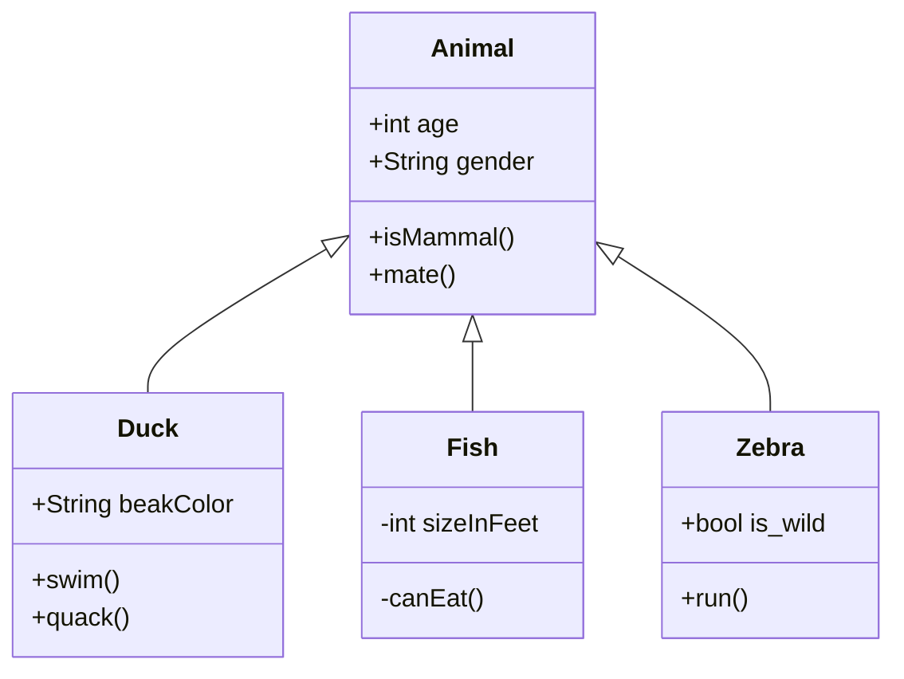
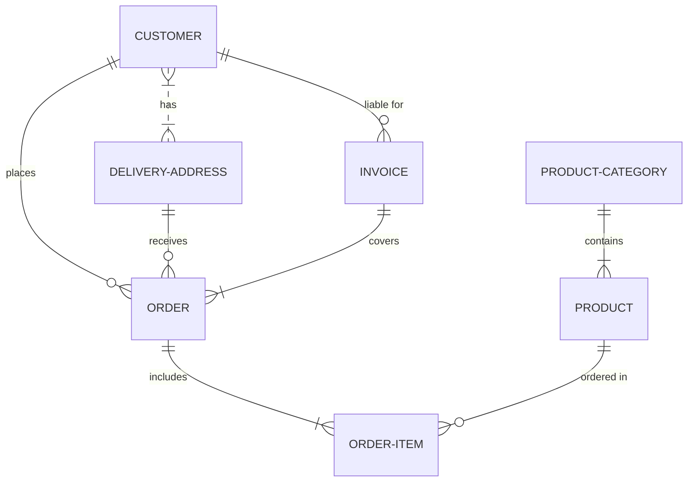
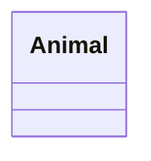
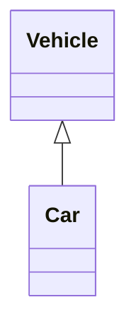
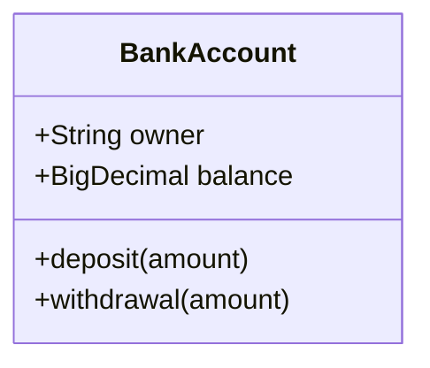
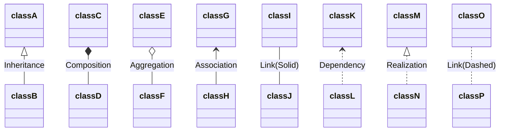

# UML

# Class Diagram



# ER Diagram


# Mermaid

[mermaid-js](https://mermaid-js.github.io/mermaid/#/classDiagram)

## Define a class



```
classDiagram
    class Animal
```



```
classDiagram
    Vehicle <|-- Car
```

## Defining Members of a class



```
classDiagram
    class BankAccount
    BankAccount : +String owner
    BankAccount : +BigDecimal balance
    BankAccount : +deposit(amount)
    BankAccount : +withdrawal(amount)
```

## Defining Relationship

|Type|Description|
|---|---|
|**<\|--**|Inheritance|
|***--**|Composition|
|**o--**|Aggregation|
|**<--**|Association|
|**--**|Link (Solid)|
|**<..**|Dependency|
|**<\|..**|Realization|
|**..**|Link (Dashed)|




```
classDiagram
    classA <|-- classB : Inheritance
    classC *-- classD : Composition
    classE o-- classF : Aggregation
    classG <-- classH : Association
    classI -- classJ : Link(Solid)
    classK <.. classL : Dependency
    classM <|.. classN : Realization
    classO .. classP : Link(Dashed)
```

# Reference
* https://en.wikipedia.org/wiki/Unified_Modeling_Language
* https://www.nextree.co.kr/p6753/amp
