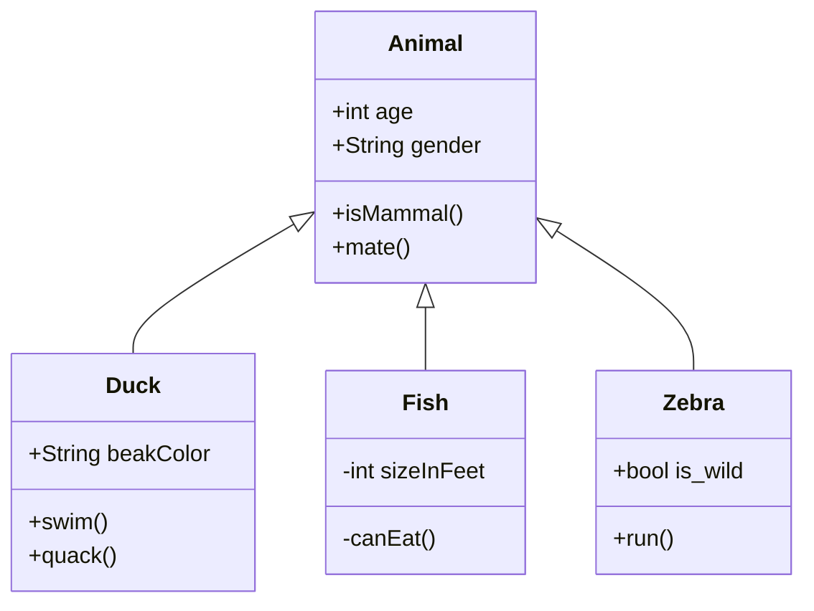
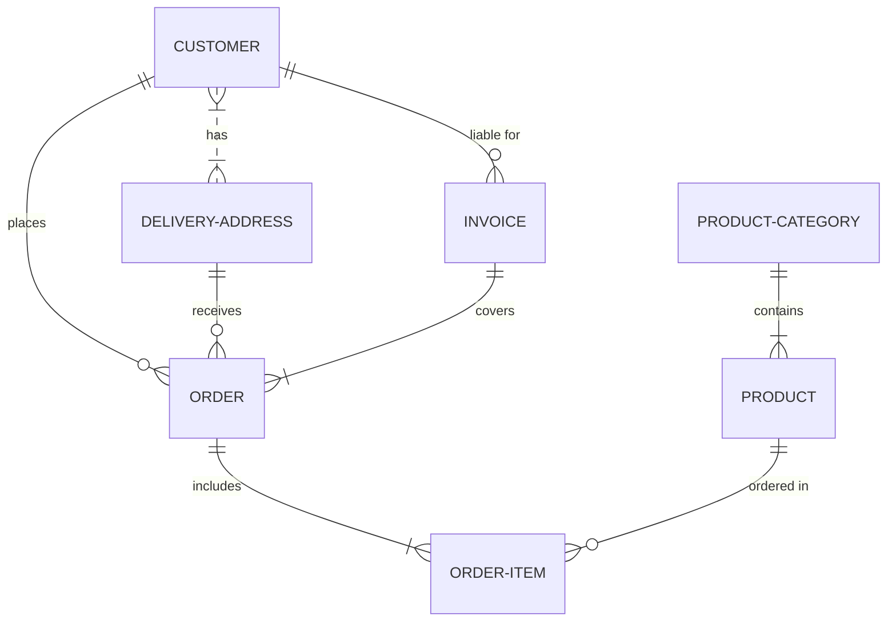

# UML

```mermaid
 classDiagram
      Animal <|-- Duck
      Animal <|-- Fish
      Animal <|-- Zebra
      Animal : +int age
      Animal : +String gender
      Animal: +isMammal()
      Animal: +mate()
      class Duck{
          +String beakColor
          +swim()
          +quack()
      }
      class Fish{
          -int sizeInFeet
          -canEat()
      }
      class Zebra{
          +bool is_wild
          +run()
      }
```

```mermaid
  erDiagram

    CUSTOMER }|..|{ DELIVERY-ADDRESS : has
    CUSTOMER ||--o{ ORDER : places
    CUSTOMER ||--o{ INVOICE : "liable for"
    DELIVERY-ADDRESS ||--o{ ORDER : receives
    INVOICE ||--|{ ORDER : covers
    ORDER ||--|{ ORDER-ITEM : includes
    PRODUCT-CATEGORY ||--|{ PRODUCT : contains
    PRODUCT ||--o{ ORDER-ITEM : "ordered in"
```
