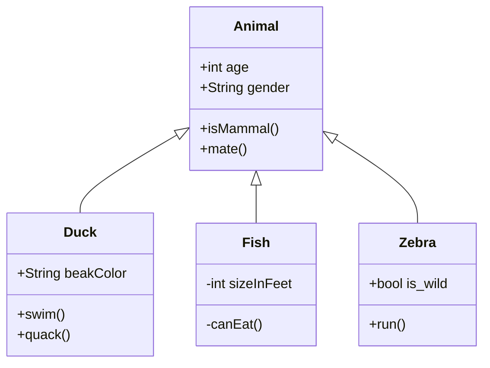
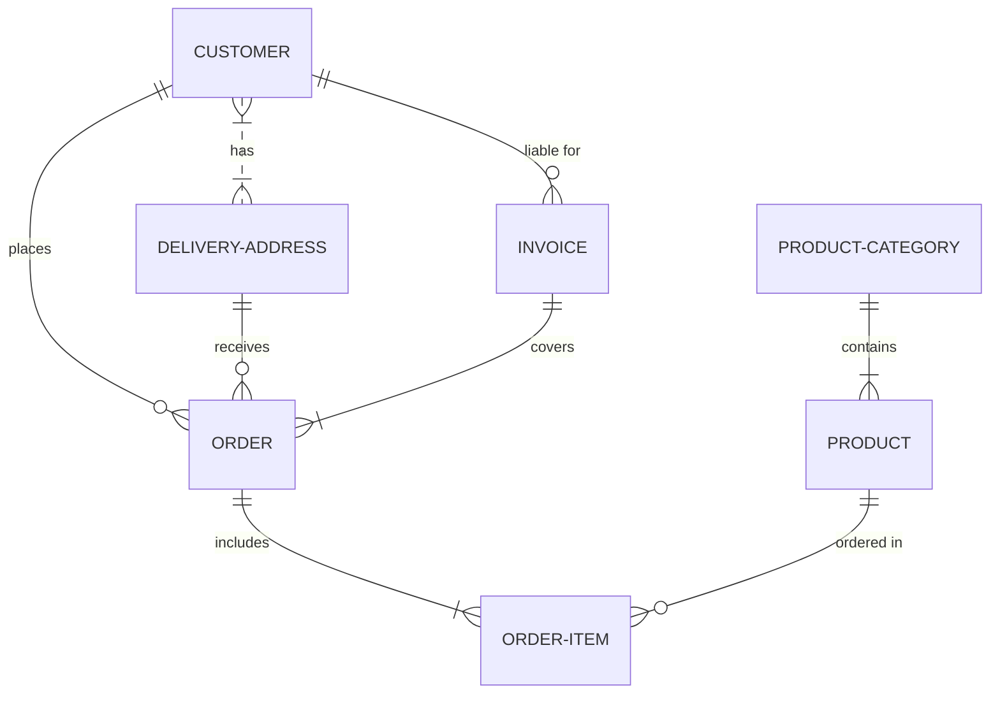
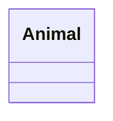
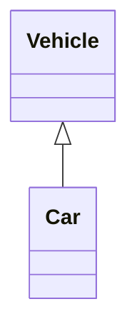
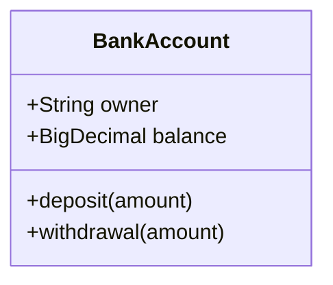
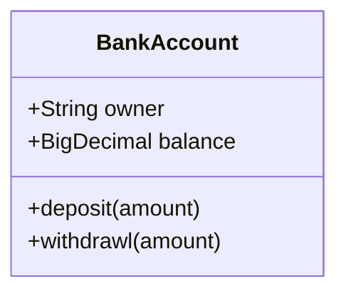
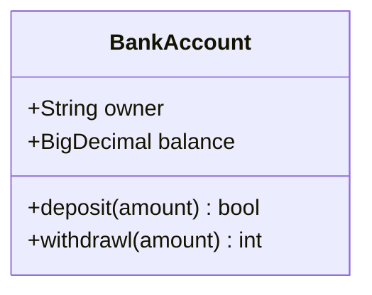
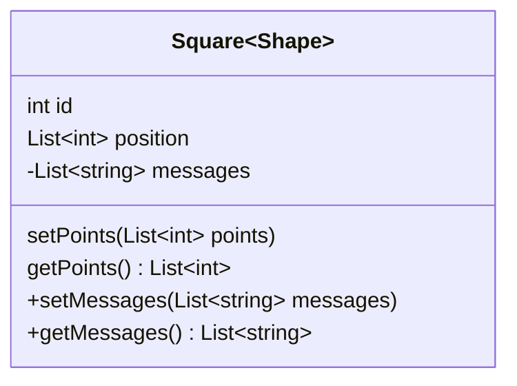
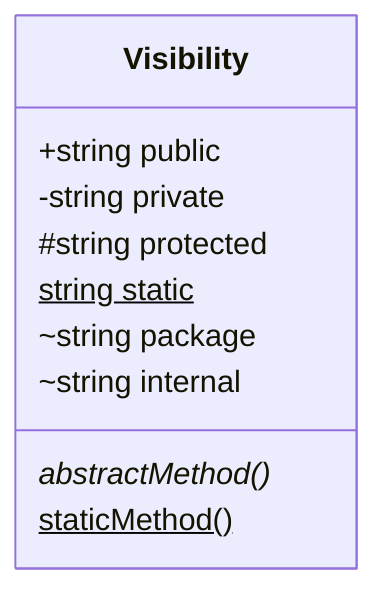
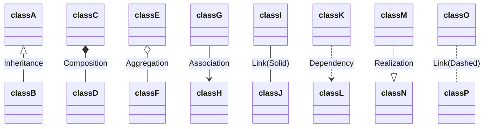

# UML

# Class Diagram



# ER Diagram


# Mermaid

## Class Diagram

[mermaid-js](https://mermaid-js.github.io/mermaid/#/classDiagram)

### 클래스 정의



```
classDiagram
    class Animal
```



```
classDiagram
    Vehicle <|-- Car
```

### 클래스 멤버 정의

#### 각각 정의하기


```
classDiagram
    class BankAccount
    BankAccount : +String owner
    BankAccount : +BigDecimal balance
    BankAccount : +deposit(amount)
    BankAccount : +withdrawal(amount)
```
* 콜론 사용 (클래스명 : 멤버 표현식)

#### 한 번에 정의하기

```
classDiagram
    class BankAccount {
        +String owner
        +BigDecimal balance
        +deposit(amount)
        +withdrawl(amount)
    }
```

* 멤버를 중괄호로 감싸기 (진짜 클래스 문법처럼)

#### 리턴 타입 정의하기


```
classDiagram
    class BankAccount{
        +String owner
        +BigDecimal balance
        +deposit(amount) bool
        +withdrawl(amount) int
    }
```
* 메소드 표현식 뒤에 한 칸 띄고 타입 작성

#### 제네릭 정의하기

```
classDiagram
    class Square~Shape~{
        int id
        List~int~ position
        setPoints(List~int~ points)
        getPoints() List~int~
    }

    Square : -List~string~ messages
    Square : +setMessages(List~string~ messages)
    Square : +getMessages() List~string~
```
* 꺽쇄 대신에 물결표 사용하여 표현

#### 접근 제한자

```
classDiagram
    class Visibility{
        +string public
        -string private
        #string protected
        string static$
        ~string package
        ~string internal
        abstractMethod()*
        staticMethod()$
    }
```
### 관계 정의

|Type|Description|
|---|---|
|**<\|--**|Inheritance, 상속|
|***--**|Composition, 합성|
|**o--**|Aggregation, 집합|
|**-->**|Association, 연관|
|**--**|Link (Solid)|
|**..>**|Dependency, 의존|
|**..\|>**|Realization, 실체화|
|**..**|Link (Dashed)|




```
classDiagram
    classA <|-- classB : Inheritance
    classC *-- classD : Composition
    classE o-- classF : Aggregation
    classG --> classH : Association
    classI -- classJ : Link(Solid)
    classK ..> classL : Dependency
    classM ..|> classN : Realization
    classO .. classP : Link(Dashed)
```

# Reference
* https://en.wikipedia.org/wiki/Unified_Modeling_Language
* https://www.nextree.co.kr/p6753/amp
